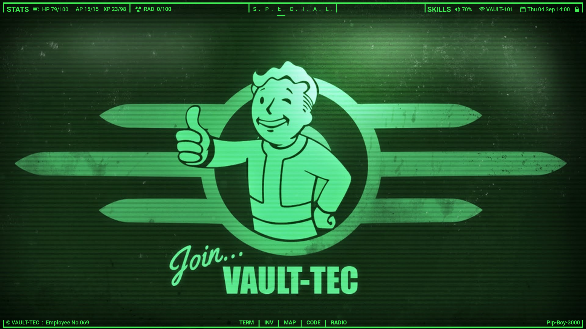
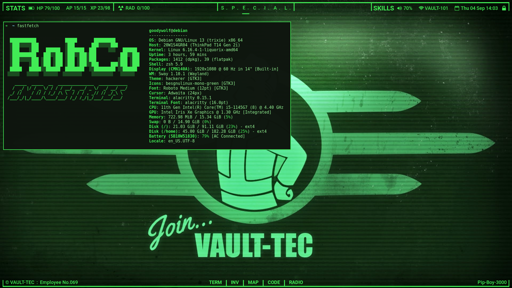
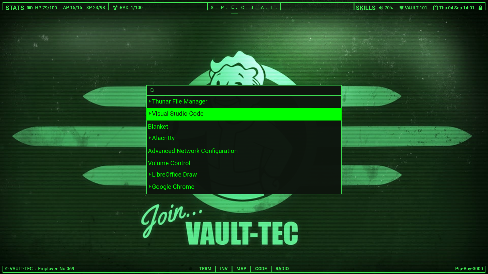
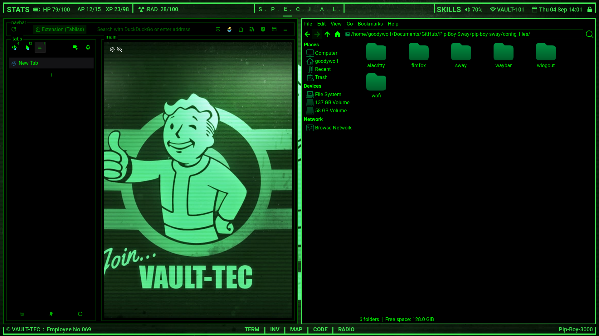
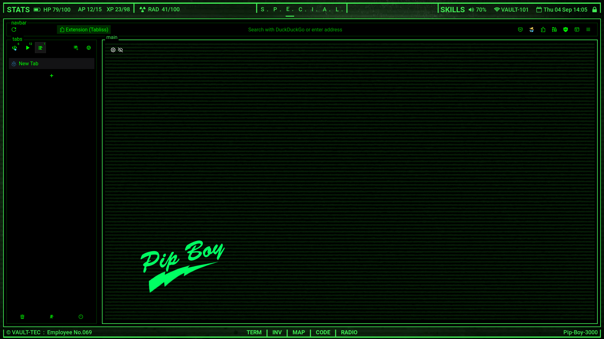
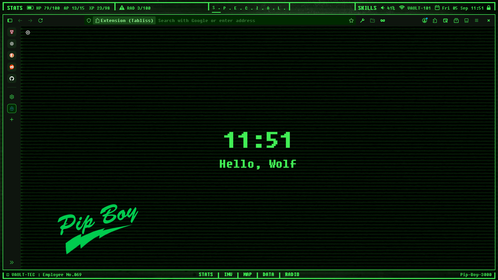
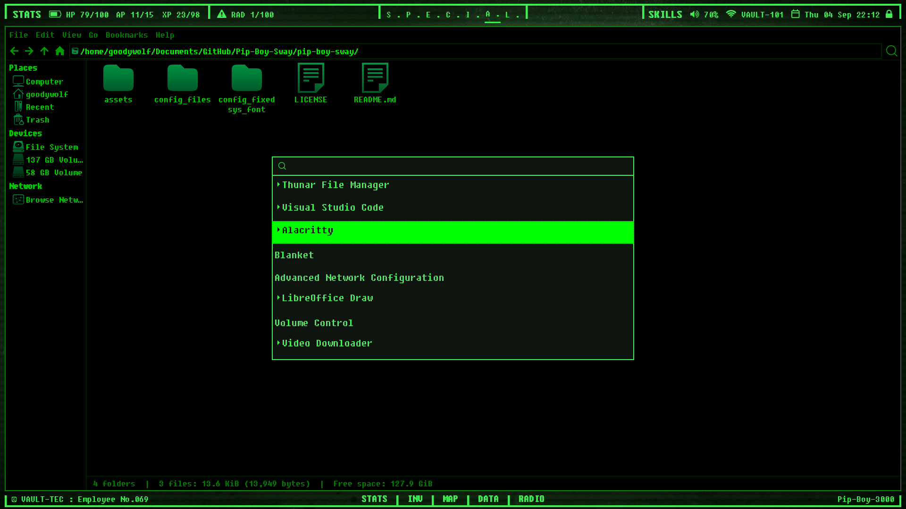

# Join... VAULT - TEC (debian + sway fallout theme)

> This setup made within Debian 13 + Sway @1920x1080 display for 2k, 4k you might need to adjust to match your screen, Also this project is a personal config for my Thinkpad T14 gen 2 (i)

> Man..really love to see if someone can put it on actual old computer..

*So, if you still want to join VAULT-TEC let's jump right in!*


## BEFORE INSTALL

NOTE: If you new to Sway / Don't has much experience on config stuff, Recommend you see my full guide on how I [setup debian with sway](https://github.com/Tong-ST/debian_sway) (I build this theme on top of that setup, So is also good reference)

Package you may need to make it functional with my setup. (I will assume you already setup debian + sway correctly and ready to use)

> Others Distro than Debian base might have to find package by yourself just make sure we on wayland like Sway/Waybar for others like Hyprland/Waybar you may need to workaround for main config.. 
```
sudo apt install waybar wofi alacritty swaybg swaylock wlogout \
ranger calcurse pavucontrol htop thunar network-manager \
fonts-font-awesome fonts-roboto wlsunset lxappearance
```
Optional for laptop, You may need some flatpak app like `tlpui` : `flatpak install flathub com.github.d4nj1.tlpui` I link with battery button-click

## SETUP MAIN CONFIG

1. Git clone if not already
    ```
    git clone https://github.com/Tong-ST/pip-boy-sway.git
    cd pip-boy-sway
    ```
2. Copy .config file or Manually copy files in configs folder to `~/.config/`
    ```
    cp -r /config_files/sway/ ~/.config/ 
    cp -r /config_files/waybar/ ~/.config/
    ```
    At this step let's see Sway + Waybar work together correctly. by Logout and Login back if you see waybar appear and sway doesn't prompt an error your good to go..

3. More .config 
    
    
    ```
    cp -r /config_files/alacritty/ ~/.config/ 
    cp -r /config_files/wofi/ ~/.config/
    cp -r /config_files/wlogout/ ~./config/
    cp -r /config_files/fastfetch/ ~/.config/
    ```
    
    Use `WIN` + `D` try run Wofi Also check on alacritty for some color tweak
## FINAL TOUCH
This section you will do more customization for finishing touch this setup

1. Setup GTK Theme & Icons


    - For matching theme i use [hackerer](https://www.pling.com/p/2010119/) This theme kinda perfect match for my Pip-Boy setup..show theme some support.
    - For icon i use [Besgnulinux Monochrome Icon Theme](https://www.gnome-look.org/p/2151189) Green version for matching color and simple style
    - After install just use lxappearance / gnome-tweaks to set theme/icon

2. Setup Firefox

    - First thing for firefox i use [Textfox](https://github.com/adriankarlen/textfox) theme as base You can see installation guide on his git and use `chrome, user.js` from me, Don't forget to give a STARTS for Textfox :D 
        - In firefox also install `sidebery` for vertical bar, `tabliss` for new-tab show-off wallpaper like mine
        - You don't need any color theme in firefox just leave it system theme - auto, Hackerer theme we use at GTK also cover firefox

    - Alternatively, Just install Firefox from `Flatpak` you'll get newer version will have Vertical Bar, built-in, Also Use Extension call `Firefox Color` And use this [PresetColor](https://color.firefox.com/?theme=XQAAAAIhAQAAAAAAAABBqYhm849SCia2CaaEGccwS-xMDPrv2SwuLIs3iGA6UYYFlQ3E_J3J--LFIfjU9jzbvZ81lXtVpqJS-43xQcdcMSfbvU-16xKAgrIzMbI88TJK_FgW48SuRf7gBtUGC_KU3zgNb0S1qR0ySXK5j2PdQdrnswcrdMIqonp8T4P17tL8bqP2QXFX4Jdn6GcPzvs4Sf1l72vqKeCRV_yQFck8QV8wo5CuHT4rnwfwSla2_4Y0sAA) That I Theming to match my setup, Clean and easy than method above, It's look something like this :
    
3. Update Grub-theme (Optional But Cool~)
    - I also found really awesome grub theme that match fallout terminal style see here [Fallout Grub](https://www.pling.com/p/1230882/)


# AFTER INSTALL
1. Go adjust for your preference those .config `nano ~/.config/sway/config`
    - Sway config also has `theme.conf` that adjust window color stuff & `workspace.conf` that for workspace control

2. Make it your currently button on waybar is set to run my program, So some button might not work for you `nano ~/.config/waybar/config` & `style.css` as well
    - waybar also have `nano ~/.config/waybar/waybar_buttom/config` that another bar for bottom bar you can use it or disable as you want

3. Just found really cool font that go really well with this setup call `Fixedsys Excelsior 3.01` It's good i promised but you have to change config by yourself first, It might be good to get familiar with all the config, For waybar you might have to adjust margin stuff till it match..

    - So, Update for some config of `waybar` for this Fixedsys Font just use config in folder `config_fixedsys_font` instead.
    - Here's The look, RAD symbol got overwritten, Use warning sign for Now, 
4. Make it more Awesome! like you can set wallpaper for each workspace, Just google for how to adjust this & that you'll be good to go..

5. Some more sound effect, I'm using on laptop that `Keyboard` sound not that great, So Let's make it even more nostalgia!
    - For my specific setup I use `bucklespring` It will simulate keyboard spring sound from retro PC, also like Mechanical Keyboard now a day, So if you already have good keyboard sound you can skip it
    - To install in debian + wayland you have to build from source to make it system-wide
        - `git clone https://github.com/zevv/bucklespring && cd ./bucklespring/`
        - `sudo apt-get install libopenal-dev libalure-dev libxtst-dev pkg-config libinput-dev`
        - `make libinput=1`
        - `sudo usermod -aG input YOURUSERNAME` might need to logout and login back
        - Then in git bucklespring folder use `./buckle` to run 
        
        - Or use a custom script to autostart in sway config add this `exec /home/USERNAME/scripts/buckle_up.sh`
            - `mkdir scripts/`
            - Copy `buckle_up.sh` script from my Git Drop into ~/scripts/
            - `nano buckle_up.sh` Might need to adjust path of your bucklespring Git where your clone to
            - That's it try logout and login back to see keyboard sound effect
            

- My Default Key-Binding
    - ``` WIN+SHIFT+E ``` = logout 
    - ``` WIN+SHIFT+W ``` = Close window/application
    - ``` WIN+SHIFT+C ``` = Reload sway config file to see changes (Error might show, better fix what's wrong before move on)
    - ``` WIN+D ``` = Search for app using wofi
    - ``` WIN+ENTER ``` = Open alacritty terminal
    - ``` WIN+Z ``` = Open your browser default with Firefox

- **Colors Ref.**
    

**So, Now you an officially VAULT-TEC employee like mine, have fun!**

### Thanks & Support
- [Hackerer](https://www.pling.com/p/2010119/) Awesome GTK Theme that match well with my setup
- [Textfox](https://github.com/adriankarlen/textfox) Awesome Firefox theme 
- [Fallout Grub](https://www.pling.com/p/1230882/) Awesome grub-theme that so, cool!
- [Besgnulinux Monochrome Icon Theme](https://www.gnome-look.org/p/2151189) Awesome monochrome icon pack that go well with this setup
- [Wallpapers](https://getwallpapers.com/collection/fallout-pip-boy-wallpaper-hd) here wallpapers that i use 
- You guy feel free to Clone / Fork / Star just don't forget about credit :D
