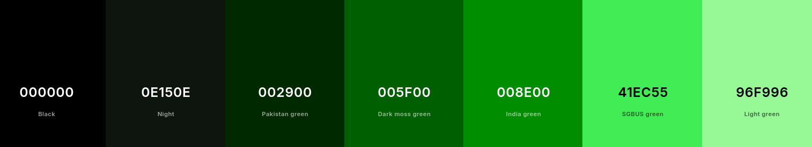

# Join... VAULT - TEC (debian + sway fallout theme)

> This setup made within Debian 13 + Sway @1920x1080 display for 2k, 4k you might need to adjust to match your screen, Also this project is a personal config for my Thinkpad T14 gen 2 (i)

> Man..really love to see if someone can put it on actual old computer..

*So, if you still want to join VAULT-TEC let's jump right in!*


## BEFORE INSTALL

NOTE: If you new to Sway / Don't has much experience on config stuff, Recommend you see my full guide on how I [setup debian with sway](https://github.com/Tong-ST/debian_sway) (I build this theme on top of that setup, So is also good reference)

Package you may need to make it functional with my setup. (I will assume you already setup debian + sway correctly and ready to use)

> Others Distro than Debian base might have to find package by yourself just make sure we on wayland like Sway/Waybar for others like Hyprland/Waybar you may need to workaround for main config.. 
```
sudo apt install waybar wofi alacritty swaybg swaylock wlogout \
ranger calcurse pavucontrol htop thunar network-manager \
fonts-font-awesome fonts-roboto wlsunset lxappearance
```
Optional for laptop, You may need some flatpak app like `tlpui` : `flatpak install flathub com.github.d4nj1.tlpui` I link with battery button-click

## SETUP MAIN CONFIG

1. Git clone if not already
    ```
    git clone https://github.com/Tong-ST/pip-boy-sway.git
    cd pip-boy-sway
    ```
2. Copy .config file or Manually copy files in configs folder to `~/.config/`
    ```
    cp -r /config_files/sway/ ~/.config/ 
    cp -r /config_files/waybar/ ~/.config/
    ```
    At this step let's see Sway + Waybar work together correctly. by Logout and Login back if you see waybar appear and sway doesn't prompt an error your good to go..

3. More .config 
    
    
    ```
    cp -r /config_files/alacritty/ ~/.config/ 
    cp -r /config_files/wofi/ ~/.config/
    cp -r /config_files/wlogout/ ~./config/
    cp -r /config_files/fastfetch/ ~/.config/
    ```
    
    Use `WIN` + `D` try run Wofi Also check on alacritty for some color tweak
## FINAL TOUCH
This section you will do more customization for finishing touch this setup

1. Setup GTK Theme & Icons


    - For matching theme i use [hackerer](https://www.pling.com/p/2010119/) This theme kinda perfect match for my Pip-Boy setup..show theme some support.
    - For icon i use [Besgnulinux Monochrome Icon Theme](https://www.gnome-look.org/p/2151189) Green version for matching color and simple style
    - After install just use lxappearance / gnome-tweaks to set theme/icon

2. Setup Firefox

    - First thing for firefox i use [Textfox](https://github.com/adriankarlen/textfox) theme as base You can see installation guide on his git and use `chrome, user.js` from me, Don't forget to give a STARTS for Textfox :D 
        - In firefox also install `sidebery` for vertical bar, `tabliss` for new-tab show-off wallpaper like mine
        - You don't need any color theme in firefox just leave it system theme - auto, Hackerer theme we use at GTK also cover firefox
    - In Firefox window/UI might be greenery but it doesn't effect your main web-surfing that much


## WHAT'S NEXT
1. Go adjust for your peference those .config `nano ~/.config/sway/config`
    - Sway config also has `theme.conf` that adjust window color stuff & `workspace.conf` that for workspace control

2. Make it your currently button on waybar is set to run my program, So some button might not work for you `nano ~/.config/waybar/config` & `style.css` as well
    - waybar also have `nano ~/.config/waybar/waybar_buttom/config` that another bar for bottom bar you can use it or disable as you want

3. Make it more Awesome! like you can set wallpaper for each workspace, Just google for how to adjust this & that you'll be good to go..

- My Default Key-Binding
    - ``` WIN+SHIFT+E ``` = logout 
    - ``` WIN+SHIFT+W ``` = Close window/application
    - ``` WIN+SHIFT+C ``` = Reload sway config file to see changes (Error might show, better fix what's wrong before move on)
    - ``` WIN+D ``` = Search for app using wofi
    - ``` WIN+ENTER ``` = Open alacritty terminal
    - ``` WIN+Z ``` = Open your browser default with Firefox

- **Colors Ref.**
    

**So, Now you an officially VAULT-TEC employee like mine, have fun!**